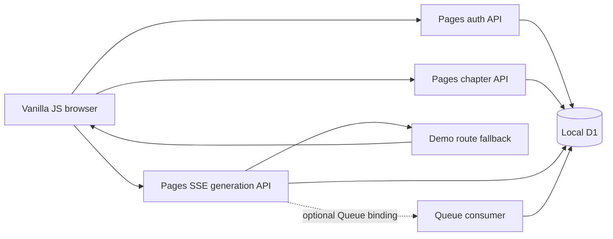

# WriteFlow — Engineering Showcase

A runnable, deliberately scoped portfolio adaptation of WriteFlow, a web-fiction writing product. This repository shows one complete path through a browser UI, authenticated Cloudflare Pages Functions, D1 persistence, streamed output, provider fallback and testable background processing. It is **not** the production application or a claim that the production source is fully public.

The generation provider here is deterministic. It makes **no external AI request**, needs **no API key**, and contains **no production writing prompt**. Toggle “Simulate primary provider failure” in the UI to see a backup route take over before output starts.

## Run locally

Requires Node.js 24 and npm. No frontend build step or framework is used.

```bash
npm ci
npx wrangler d1 execute writeflow-showcase-local --local --file=db/schema.sql
npm run dev
```

Open <http://127.0.0.1:8791>. Create an invented handle and password, add a chapter, enter a story beat, then generate. In a second terminal:

```bash
npm run test:all
npm run smoke
```

The smoke command uses the running Pages server and local D1. It creates only synthetic records and deletes its chapter afterward. `wrangler.jsonc` uses a placeholder database ID for local development; a separate Cloudflare D1 database and config are required before deployment. The compatibility date is pinned to `2026-07-15`, the newest date supported by the Wrangler runtime verified in this workspace.

## Follow one request through the code

```text
frontend/app.js
  → /api/auth/register or /api/auth/login → D1 users + hashed sessions
  → /api/chapters → D1 chapters, always scoped by user ID
  → /api/generate → demo provider routing → SSE chunks → browser output
  → D1 generation_history only after completion
  → /api/history → current user's saved output

Optional production-style path:
  completed history → BACKGROUND_QUEUE → workers/background.js
                    → idempotent generation_stats row
```

The optional Queue binding is not provisioned by the local demo. Its consumer and failure behavior are independently exercised by `tests/queue.test.js`; the main browser journey runs entirely with local Pages and D1.



## Engineering decisions worth inspecting

- **Do not mix providers mid-stream.** `functions/lib/provider-fallback.js` retries only before any upstream chunk has been committed. `tests/provider-fallback.test.js` covers early failure, late failure and cancellation.
- **Keep internal reasoning out of prose.** `functions/lib/output-sanitizer.js` retains incomplete `<think>` tag prefixes across chunks. This module comes from the private production code with a public file header added.
- **Keep ownership in every query.** Chapter updates/deletes, generation and history reads are scoped to the authenticated user. SQLite-backed tests exercise cross-account access.
- **Save only complete results.** Cancelled or failed streams do not create history rows; the browser keeps text it has already received. `tests/generate.test.js` checks the path.
- **Treat Queue messages as repeatable.** The optional consumer acknowledges after success, retries on D1 failure and uses a unique history key for idempotent derived statistics.

## What this public edition contains

The UI and its auth/chapter/generation routes were adapted into a smaller, independently runnable example. `workers/queue-task.js` and the reasoning filter preserve narrow production logic; provider fallback and D1 ownership rules demonstrate the same engineering constraints with safe demo configuration. See [PUBLIC_SCOPE.md](PUBLIC_SCOPE.md) for the file-level boundary.

Production prompts, genre/tag rules, real model routes and credentials, customer data, billing, email flows, and the full RAG pipeline are intentionally excluded. The public demo has its own schema and must not be connected to the production D1 database.

## Verification and use

`npm run test:all` uses Node's built-in test runner and actual SQLite SQL semantics. CI runs the tests and compiles the Pages Functions. A local Pages + D1 smoke script covers the HTTP path. This public repository has no open-source license; code is shared for evaluation, not granted for reuse.
